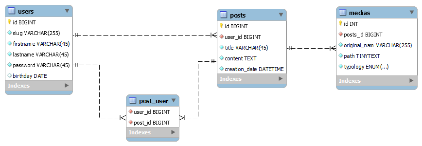

Social Platform
===

1. 
> SELECT users.username, TIMESTAMPDIFF(YEAR, birthdate, CURRENT_DATE) AS age FROM `users`;

2. 
> SELECT * FROM posts LEFT JOIN likes ON posts.id = likes.post_id WHERE likes.user_id IS NULL;

3. 
> SELECT posts.title, COUNT(likes.post_id) AS likes FROM posts JOIN likes ON posts.id = likes.post_id GROUP BY likes.post_id;

4. 
> SELECT users.username, COUNT(medias.user_id) AS medias FROM users JOIN medias ON users.id = medias.user_id GROUP BY medias.user_id ORDER BY medias DESC;

5. 
> SELECT users.username, COUNT(likes.user_id) AS likes FROM users JOIN likes ON users.id = likes.user_id GROUP BY likes.user_id ORDER BY likes DESC;

6. 
> SELECT users.username, posts.title, TIMESTAMPDIFF(YEAR, birthdate, CURRENT_DATE) AS age FROM users JOIN posts ON posts.user_id = users.id WHERE TIMESTAMPDIFF(YEAR, birthdate, CURRENT_DATE) < 30 AND TIMESTAMPDIFF(YEAR, birthdate, CURRENT_DATE) >= 20;

7. 
> SELECT users.id, users.username, COUNT(DISTINCT posts.id) AS posts, COUNT(DISTINCT medias.id) AS medias FROM users JOIN posts ON users.id = posts.user_id JOIN media_post ON posts.id = media_post.post_id JOIN medias ON media_post.media_id = medias.id GROUP BY users.id;

8. 
> SELECT posts.title, posts.tags FROM posts WHERE tags LIKE '%"serata"%';

9. 
> SELECT posts.title, JSON_LENGTH(posts.tags) AS tags FROM posts ORDER BY tags ASC;

10. 
> SELECT users.username, SUM(JSON_LENGTH(posts.tags)) AS tags FROM posts JOIN users ON posts.user_id = users.id GROUP BY users.id ORDER BY tags ASC;